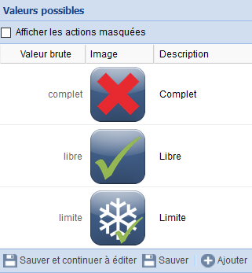

# eedomus_lpa
## Description
*eedomus_lpa* est un script pour la box domotique *eedomus*.

Il permet de récupérer les données de places disponibles dans les parkings gérés par LPA à Lyon et alentours.
Pratique pour être alerté quand un parking est plein et pouvoir en choisir un autre avant de se trouver à proximité, non ? ;-)


## Installation
1. Télécharger le projet sur GitHub : [github.com/gsn01/eedomus_lpa](https://github.com/gsn01/eedomus_lpa/archive/master.zip)
1. Uploader le fichier *lpa.php* sur la box ([doc eedomus scripts](http://doc.eedomus.com/view/Scripts#Script_HTTP_sur_la_box_eedomus))

## Tester
Ce script peut ensuite être testé au travers du lien suivant dans le navigateur

	http://[ip_de_votre_box]/script/?exec=lpa.php&seuil=100

où il faut remplacer *[ip_de_votre_box]* par l'IP de votre Box *eedomus*. Le paramètre ```seuil``` est optionnel. Par défaut, il est positionné à la valeur 10.

Exemple :	http://192.168.1.2/script/?exec=lpa.php&seuil=100

## Résultat
Le résultat est au format XML.

Exemple de résultat
```xml
<<parkings>
  <parking>
    <nom>Saint Antoine</nom>
    <dispo>227</dispo>
  </parking>
  <parking>
    <nom>Saint Georges</nom>
    <dispo>307</dispo>
  </parking>
  ...
  <parking>
    <nom>Hôtel de ville Villeurbanne</nom>
    <dispo>272</dispo>
  </parking>
</parkings>
```

## Correspondance XPATH

Les différentes informations possibles retournées par les Xpath suivants :

- ```/parkings/parking/nom``` : Le nom du parking
- ```/parkings/parking/places``` : Le nombre de places disponibles
- ```/parkings/parking/dispo``` : Indicateur de disponibilité (valeurs : ```libre``` ou ```limite``` ou ```complet```)
- 	La valeur ```libre``` indique que le nombre de places disponibles est supérieur au seuil indiqué (10 par défaut).
- 	La valeur ```limite``` indique que le nombre de places disponibles est compris entre 0 et le paramètre ```seuil```.
- 	La valeur ```complet``` indique que le nombre de places disponibles est égal à 0.

## Un exemple d'exploitation avec l'eedomus

Créer un nouveau périphérique de type *Capteur HTTP*

Renseigner les paramètres suivants :

- Unité : ```pl.```
- Type de données : ```Nombre décimal```
- URL de la requête : ```http://localhost/script/?exec=lpa.php&seuil=30```
- Chemin XPATH : ```/parkings/parking[nom='Gare Part-Dieu']/places```
- Fréquence de la requête : ```60```

Pour la disponibilité, le capteur doit être de type ```Liste de Valeurs```. Voici un exemple de valeurs.

<br/>

Exemple de mise en oeuvre :
 

## Notes sur les caractères accentués

Dans cette première version, les caractères accentués inclus dans les noms de parking sont correctement restitués dans le résultat XML. <br>
Par contre, pour rechercher un parking dont le nom est accentué, il faut copier/coller son nom depuis la liste des parkings disponibles.

Pour cela :
- ouvrir le testeur d'expression Xpath [https://secure.eedomus.com/xpath/](https://secure.eedomus.com/xpath/)
- "utiliser l'URL" : ```http://localhost/script/?exec=lpa.php```
- cliquer sur le bouton Tester
- la liste des parkings disponibles apparaît dans la fenêtre "Utiliser le résultat XML"
- il suffit alors de copier/coller le nom du parking au sein du chemin Xpath du capteur
